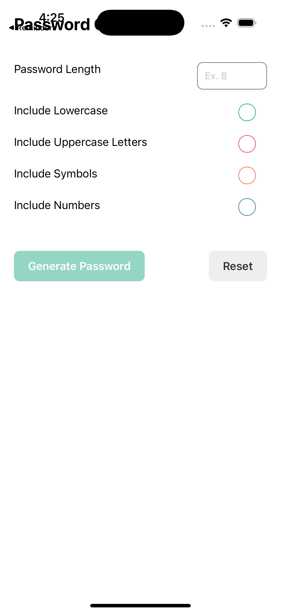
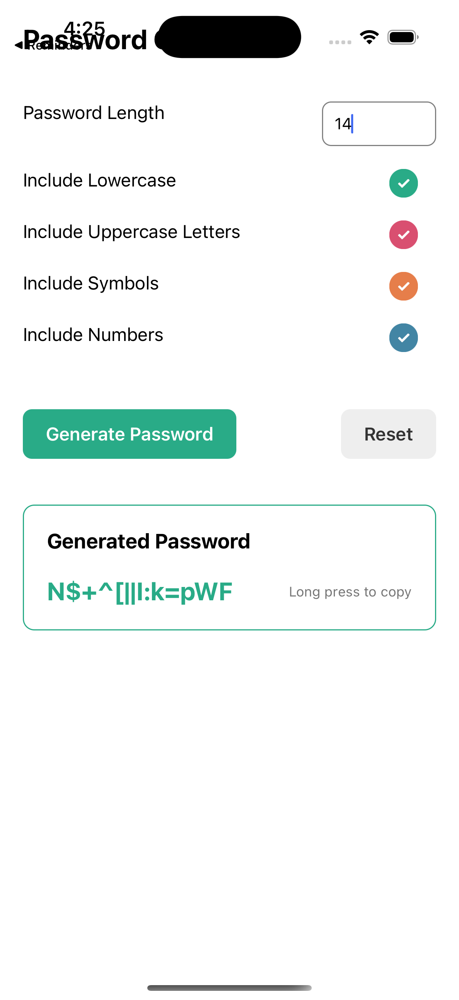

# 🔐 Password Generator

A clean, lightweight **React Native** app for generating strong, customizable passwords on the go. Choose a length, pick which character sets to include, and get a secure password you can copy to your clipboard with a single long press.

<p align="center">
  
  &nbsp;&nbsp;
  
</p>

<p align="center">
  
  
  
</p>

---

## ✨ Features

- **Custom password length** — anywhere from 4 to 16 characters, validated in real time.
- **Configurable character sets** — toggle lowercase letters, uppercase letters, numbers, and symbols independently via animated checkboxes.
- **Instant generation** — passwords are built client-side from a cryptographically-irrelevant but uniformly random character pool (no network calls, nothing leaves the device).
- **One-tap reset** — clears the form and the generated result to start fresh.
- **Copy to clipboard** — long-press the generated password to copy it instantly.
- **Form validation** — powered by Formik + Yup, with inline error messages and a disabled submit state until the input is valid.

## 📱 Screenshots

| Empty Form | Generated Password |
| :---: | :---: |
|  |  |

## 🛠 Tech Stack

| Layer | Library |
| --- | --- |
| Framework | [React Native](https://reactnative.dev) 0.87 |
| Language | TypeScript |
| Forms & Validation | [Formik](https://formik.org/) + [Yup](https://github.com/jquense/yup) |
| UI Controls | [react-native-bouncy-checkbox](https://github.com/WrathChaos/react-native-bouncy-checkbox) |
| Safe Areas | [react-native-safe-area-context](https://github.com/th3rdwave/react-native-safe-area-context) |
| Clipboard | [@react-native-clipboard/clipboard](https://github.com/react-native-clipboard/clipboard) |
| Testing | Jest + react-test-renderer |

## 🚀 Getting Started

### Prerequisites

Make sure your environment is set up per the official [React Native environment guide](https://reactnative.dev/docs/set-up-your-environment), and that you have:

- Node.js `>= 22.11.0`
- Xcode (for iOS) with CocoaPods
- Android Studio + an emulator or device (for Android)

### Installation

```bash
git clone <repository-url>
cd PasswordGenerator
npm install
```

For iOS, install the native CocoaPods dependencies:

```bash
bundle install
cd ios && bundle exec pod install && cd ..
```

### Running the app

Start the Metro bundler:

```bash
npm start
```

Then, in a separate terminal, build and launch on your platform of choice:

```bash
# iOS
npm run ios

# Android
npm run android
```

### Running tests

```bash
npm test
```

### Linting

```bash
npm run lint
```

## 🧠 How It Works

1. The user enters a **password length** (4–16), validated with a Yup schema through Formik.
2. The user toggles any combination of **lowercase**, **uppercase**, **numbers**, and **symbols**.
3. On submit, [`App.tsx`](App.tsx) concatenates the selected character sets into a single pool, then builds the password by picking a random character from that pool for each position.
4. The result is displayed in a highlighted card. **Long-pressing** the password copies it to the clipboard via `@react-native-clipboard/clipboard`.
5. **Reset** clears the form, unchecks all options, and hides the generated password.

## 📂 Project Structure

```
PasswordGenerator/
├── App.tsx              # Main app screen: form, checkboxes, password logic, UI
├── index.js              # App entry point / registration
├── __tests__/            # Jest test suite
├── ios/                   # Native iOS project
├── android/               # Native Android project
└── docs/screenshots/      # README screenshots
```

## 🤝 Contributing

Contributions, issues, and feature requests are welcome. Feel free to open a pull request or file an issue.

## 📄 License

This project is currently unlicensed. Add a `LICENSE` file to specify usage terms.
